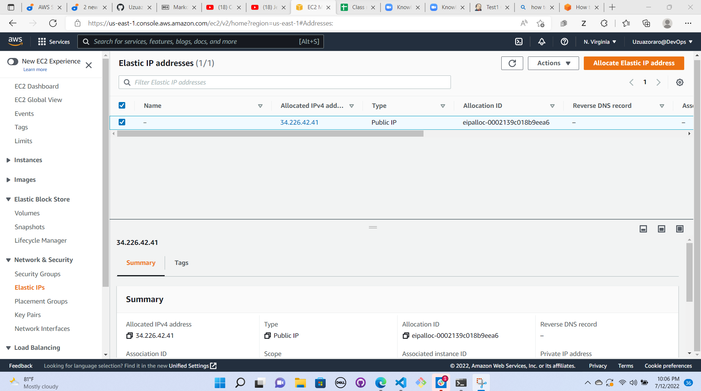

## LOAD BALANCER SOLUTION WITH NGINX AND SSL/TLS

CONFIGURE NGINX AS A LOAD BALANCER

1. Create an EC2 VM based on Ubuntu Server 20.04 LTS and name it Nginx LB (do not forget to open TCP port 80 for HTTP connections, also open TCP port 443 – this port is used for secured HTTPS connections).

Security group also updated with HTTP and HTTPS ports.

2. Register a Domain Name System (DNS). Search for Route 53. Click on Register a domain name and fill in the required information.

First step is to Login to AWS. Then click Elastic IP on the menu items on your left.

<!--  -->

You will select the Instance you want to associate this IP address to. Also click on the Private IP address. Then click Associate.

Create a record by copying and pasting the public IP address on the value section. Then click create records.

The creation of these records will connect our Domain Name, Load Balancer and Route 53.

3. Install and configure Nginx as a load balancer to point traffic to the resolvable DNS names of the webservers

Update the instance and Install Nginx

`sudo apt update`
`sudo apt install nginx`

`sudo systemctl restart nginx`
`sudo systemctl enabled nginx`
`sudo systemctl status nginx`

4. Open the default nginx configuration file

Open the default nginx configuration file using this command:
`sudo vi /etc/nginx/nginx.conf`

5. Restart Nginx and make sure the service is up and running

`sudo systemctl restart nginx`
`sudo systemctl status nginx`

6. Check that your Web Servers can be reached from your browser using new domain name using HTTP protocol – 
http://zireus.click

7. Install certbot and request for an SSL/TLS certificate
   Make sure snapd service is active and running

   `sudo systemctl status snapd`

   

   Install certbot

   `sudo snap install --classic certbot`

   

8. Request your certificate (just follow the certbot instructions – you will need to choose which domain you want your certificate  to be issued for, domain name will be looked up from nginx.conf file so make sure you have updated it on step 4.

   `sudo ln -s /snap/bin/certbot /usr/bin/certbot`

   `sudo certbot --nginx`

    

9. Set up periodical renewal of your SSL/TLS certificate
By default, LetsEncrypt certificate is valid for 90 days, so it is recommended to renew it at least every 60 days or more frequently.

You can test renewal command in dry-run mode

`sudo certbot renew --dry-run`

Best pracice is to have a scheduled job to run renew command periodically. Let us configure a cronjob to run the command twice a day.

To do so, lets edit the crontab file with the following command:

`crontab -e`

Add following line:

`* */12 * * *   root /usr/bin/certbot renew > /dev/null 2>&1`
This simply means it should be checked once every 12 hours.

You can always change the interval of this cronjob if twice a day is too often by adjusting schedule expression.

What's the problem?
